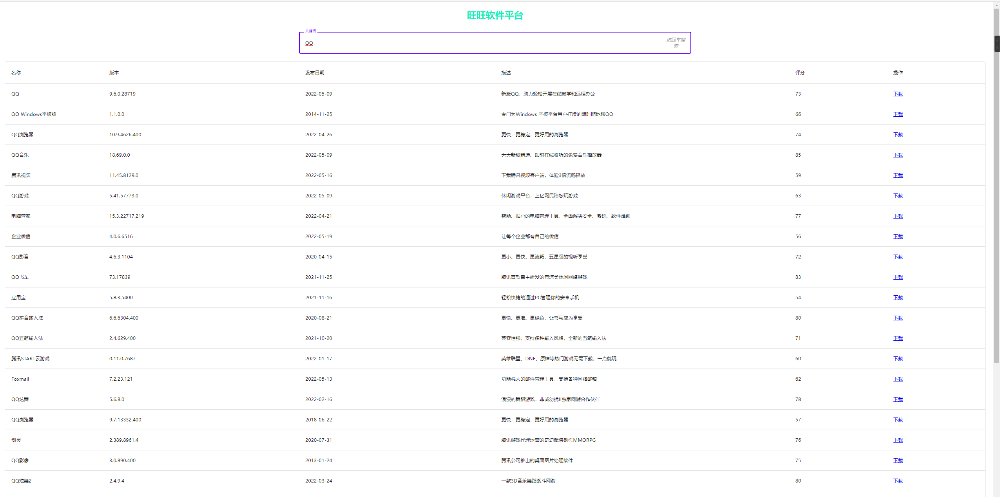

# 各种签到脚本
### 联通营业厅签到脚本 unicom_sign.py 可以点个star再走嘛!!!
* 替换手机号,密码,appId即可
* 默认配置了TG推送,需要替换自己的tgBot秘钥
* appId获取最方便的方法就是手机文件管理器，找到路径为 Unicom/appid 的文件打开复制。
* 出现No module named "Crypto" 解决办法:https://www.cnblogs.com/fawaikuangtu123/p/9761943.html
* 新增Github Action签到方式,地址https://github.com/asa1253/HiCnUnicom

### GLaDOS网站签到脚本 glados_sign.py
* 网站地址注册GLaDOS(注册地址在 https://github.com/glados-network/GLaDOS 实时更新), 并输入邀请码:HZCYH-YG3DE-K39MO-VCAPX 激活
* 若不想走我的邀请链接,直接百度也可搜索到.另外edu邮箱可以获得一年免费额度  
* 默认配置了TG推送,需要替换自己的tgBot秘钥
* 填写网站glados的cookie即可
* 推荐定时任务 30 10 * * *  ,即每天10.30签到.

### 腾讯视频签到脚本 tx_sign.py
* 腾讯视频好莱坞会员V力值签到，支持两次签到：一次正常签到，一次手机签到。
* 其余四项任务只支持任务完成后,自动领取V力值.
* 电脑打开浏览器访问v.qq.com，打开控制台(F12)、切换到Network，找到 https://access.video.qq.com/user/auth_refresh 的接口，把Request URL:后的地址都复制一下，填写到脚本的auth_refresh_url中，如：
* 复制Request Header中的cookie，填写到脚本的Cookie配置中

### CSDN自动评论脚本 csdn_sign.py
* 可以自动对CSDN热门文章进行评论,提升CSDN等级
* Cookie请通过F12获取
* 个人ID,个人名称均可在CSDN个人中心获取

### 日报生成脚本 news.py base.jpg
* 需要先安装模块, pip install cn2an , pip3 install -i https://pypi.tuna.tsinghua.edu.cn/simple opencv-python
* 推送功能请自行实现.个人使用的是微信公众号推送.
* 自定义修改文字位置,以及修改原始图片base.jpg
* 内容可自定义
* 天行数据Key请前往官网注册.
* 实现效果如下图

### 批量发送邮件脚本 sendMail.py
* 配置收件人,发件人,以及邮箱授权码
* 需要开启QQ邮箱的STMP配置,https://www.jspxcms.com/documentation/351.html

### 掘金签到脚本 juejin.py
* 配置掘金Cookie,企业微信相关配置
* 可部署服务器,使用cron定时执行.

### 线报爬取脚本 xianbao.py , url.txt
* 配置企业微信相关配置
* 可部署服务器,使用cron定时执行.

### leetcode推送脚本 leetcode.py
* 配置企业微信相关配置
* 可部署服务器,使用cron定时执行.
* 实现效果如下图  

### 简易优惠券查询助手 top文件夹,tb.py,config.ini
* config.ini中需要填写配置 淘宝联盟中获取app_key,app_password,参考https://www.jianshu.com/p/571ae950916a ,app_id为你的推广位-pid字符串取最后的一串数字即可！
* 或者直接前往http://114.96.82.213:5238/%E4%BC%98%E6%83%A0%E5%88%B8.exe  下载
* 或者去下方公众号查询优惠券
* 效果图

# 免责声明
* 代码仅供学习
* 不可用于商业以及非法目的,使用本代码产生的一切后果, 作者不承担任何责任.

# 个人公众号

